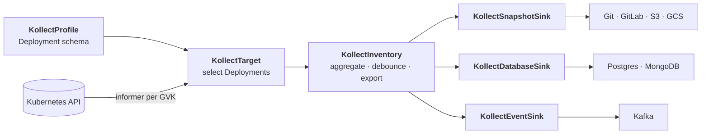
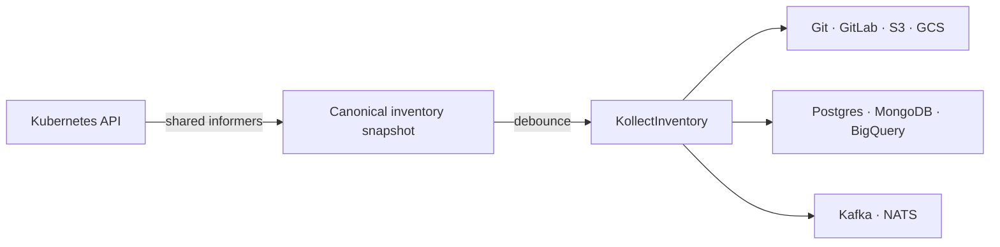

<p align="center">
  <a href="https://platformrelay.github.io/Kollect/">
    
  </a>
</p>

<p align="center">
<a href="https://github.com/platformrelay/kollect/actions/workflows/ci.yaml"></a>
<a href="https://github.com/platformrelay/kollect/actions/workflows/preflight.yaml"></a>
<a href="https://github.com/platformrelay/kollect/actions/workflows/e2e-smoke.yaml"></a>
<a href="https://platformrelay.github.io/Kollect/"></a>
<a href="https://github.com/platformrelay/kollect/actions/workflows/docs.yaml"></a>
<a href="https://github.com/platformrelay/kollect/actions/workflows/codeql.yaml"></a>
<a href="https://securityscorecards.dev/viewer/?uri=github.com/PlatformRelay/Kollect"></a>
<a href="https://github.com/platformrelay/kollect/blob/main/LICENSE"></a>
<a href="https://github.com/platformrelay/kollect/releases"></a>
<a href="https://codecov.io/gh/platformrelay/kollect"></a>
<a href="https://sonarcloud.io/summary/new_code?id=PlatformRelay_Kollect"></a>
<a href="https://pkg.go.dev/github.com/platformrelay/kollect"></a>
<a href="https://pkg.go.dev/github.com/platformrelay/kollect"></a>
<a href="https://github.com/orgs/platformrelay/packages?repo_name=kollect"></a>
</p>

<p align="center"><em>Simple to start · platform-grade to grow</em></p>

# Kollect

**Turn Kubernetes state into durable inventory.** Declare what matters once. Kollect keeps it
current and delivers it to Git, object storage, databases, and event streams. Select resources by
GVK, extract the attributes you need with CEL or JSONPath, and every sink receives the same
canonical rows in parallel.

**Start with one sink. Grow to a whole platform.** A single pipeline can write an inspectable Git
history, a queryable database record, an object-store snapshot, or an event stream—without scripts
or API-server hammering. As adoption grows, nothing gets rebuilt: the same rows fan out to more
sinks, and `KollectScope` keeps it multi-tenant. Every team owns its inventory as **configuration,
not code**, in its own namespace; consumers read **export data**, never unbounded list/watch against
the live cluster.

**Read the docs:** **[platformrelay.github.io/Kollect](https://platformrelay.github.io/Kollect/)** — architecture,
quick start, CR reference, ADRs, and examples. This README is the front door; the site is the map.

Install paths: **Helm OCI on GHCR** is primary (`oci://ghcr.io/platformrelay/kollect`). **Artifact Hub**
and **OperatorHub** discoverability are wired at release ([ADR-0708](https://platformrelay.github.io/Kollect/adr/0708-operator-distribution-hubs/));
use those hubs once listings are live — badge URLs stay out of this README until then.

> **Pre-1.0.** Kollect uses a `v1alpha1` API. Breaking API or default changes may ship in minor
> releases before 1.0; release notes and migration guidance call them out. See the
> [roadmap](https://platformrelay.github.io/Kollect/ROADMAP/) for current maturity.

## Why Kollect?

- **Decoupled read model** — consumers query a sink, not the apiserver. No RBAC blast radius, no
  watch-storm risk, no etcd size limits ([why](https://platformrelay.github.io/Kollect/adr/0103-etcd-limit/)).
- **Event-driven, no polling** — one shared informer per GVK keeps inventory current as the cluster
  changes ([ADR-0301](https://platformrelay.github.io/Kollect/adr/0301-event-driven-informers/)).
- **Schema-flexible** — declare the attributes you want in a `KollectProfile`; no bespoke collector
  per resource kind.
- **Pluggable sinks, no privileged backend** — the same snapshot fans out to Git, Postgres, object
  store, or an event stream ([sink taxonomy](https://platformrelay.github.io/Kollect/adr/0401-sink-taxonomy-state-vs-stream/)).
- **Multi-tenant by design** — `KollectScope` gates which teams, namespaces, and sinks each tenant
  may use.
- **Fleet-ready** — **N single-mode operators → one shared sink**, partitioned by `spec.cluster`; no
  central hub tier to operate ([ADR-0501](https://platformrelay.github.io/Kollect/adr/0501-multi-cluster-fleet/)).
- **Scale-aware architecture** — shared informers, export sharding, and tunable
  reconcile/dispatch concurrency; the performance guide separates measured evidence from targets
  ([performance](https://platformrelay.github.io/Kollect/operator-manual/performance/)).

## See it end-to-end

A real pipeline is a handful of Kubernetes resources. The
[first-inventory walkthrough](https://platformrelay.github.io/Kollect/getting-started/first-inventory/)
collects container images from Deployments and exports them to Git for an inspectable audit trail:



## Quick start (MVP)

Spin up a credential-free Git export on a local kind cluster in one command (needs Docker, kind,
kubectl, and [Task](https://taskfile.dev/)):

```sh
git clone https://github.com/platformrelay/kollect.git && cd kollect
task demo-up                      # preferred: kind + Forgejo + Ready Git inventory
# or: task dev-up                 # same hero path after build
kubectl get kinv,ktgt,ksnap -A    # watch Ready + ConnectionVerified
```

`task demo-up` (and `task dev-up`, which builds then runs the same hero harness) boots kind, installs
Kollect, starts in-cluster Forgejo, and applies the golden Git-only sample — **no cloud/DB Secrets**.
Watch `KollectInventory` `Ready` and sink `ConnectionVerified`, then follow the printed next steps
(clone dir / Forgejo UI). Details: [DEMO-GIF-GUIDE](docs/DEMO-GIF-GUIDE.md).

Postgres / S3 / Kafka / multi-sink samples are an explicit opt-in:

```sh
kubectl apply -k config/samples/advanced/
```

## How it works



The in-memory snapshot per inventory is **canonical**; every sink is a **projection** of it — no
single backend is privileged ([sink roles](https://platformrelay.github.io/Kollect/adr/0401-sink-taxonomy-state-vs-stream/)).
Sinks are split into three CRD families ([ADR-0414](https://platformrelay.github.io/Kollect/adr/0414-sink-family-crds/)):

| Sink family | Examples | Good for |
| --- | --- | --- |
| **`KollectSnapshotSink`** | Git, GitLab, S3, GCS | Audit, diff, GitOps-friendly history |
| **`KollectDatabaseSink`** | Postgres, MongoDB | Rich queries for portals and dashboards |
| **`KollectEventSink`** | Kafka, NATS | Change streams, downstream consumers |

### Supported & planned sinks

Honest maturity tiers — see the [roadmap](https://platformrelay.github.io/Kollect/ROADMAP/#supported-planned-sinks)
for release timing.

| Family CRD | `spec.type` | Status |
| --- | --- | --- |
| `KollectSnapshotSink` | `git` | **Core** — production-ready |
| `KollectSnapshotSink` | `gitlab` | **Core** |
| `KollectSnapshotSink` | `s3` | **Core** |
| `KollectSnapshotSink` | `gcs` | **Beta** — shipped, maturing |
| `KollectDatabaseSink` | `postgres` | **Core** |
| `KollectDatabaseSink` | `mongodb` | **Beta** |
| `KollectDatabaseSink` | `bigquery` | **Beta** — analytics SQL |
| `KollectEventSink` | `kafka` | **Beta** |
| `KollectEventSink` | `nats` | **Beta** — JetStream emitter |
| `KollectSnapshotSink` | `azureblob` | **Planned** — needs real backend ([roadmap](https://platformrelay.github.io/Kollect/roadmap/planned-features/)) |
| `KollectSnapshotSink` | `s3`, `gcs` with `serialization.format: parquet` | **Beta** — shipped object-store output mode |

Full payload lives in sinks; CR `.status` holds summaries only ([etcd limits](https://platformrelay.github.io/Kollect/adr/0103-etcd-limit/)).

## Performance

Kollect is designed for **large single clusters** and **multi-cluster fleets**. The
**[performance guide](https://platformrelay.github.io/Kollect/operator-manual/performance/)** distinguishes
reproducible results from design targets and documents tuning for reconcile concurrency, export
debounce, and sharding. Fleet fan-in uses shared sinks rather than a hub merge tier.

## Learn more

| Topic | Link |
| --- | --- |
| Problem statement, CRD model, reconciliation | [Architecture](https://platformrelay.github.io/Kollect/concepts/architecture/) |
| Locked platform decisions | [Platform decisions](https://platformrelay.github.io/Kollect/PLATFORM-DECISIONS/) |
| CR fields, RBAC, failure modes | [CR reference](https://platformrelay.github.io/Kollect/crds/) |
| Multi-cluster fleet | [ADR-0501](https://platformrelay.github.io/Kollect/adr/0501-multi-cluster-fleet/) |
| Sink taxonomy (state vs stream) | [ADR-0401](https://platformrelay.github.io/Kollect/adr/0401-sink-taxonomy-state-vs-stream/) |
| Shipped, next, and later work | [Roadmap](https://platformrelay.github.io/Kollect/ROADMAP/) |
| Examples index | [Examples](https://platformrelay.github.io/Kollect/examples/) |
| Example: Deployment → Git export | [Walkthrough](https://platformrelay.github.io/Kollect/getting-started/first-inventory/) |
| Live demo inventory (Git sink) | [kollect-inventory-demo](https://github.com/konih/kollect-inventory-demo) |

Developers: run `task lint`, `task test`, and `task verify` before opening a PR —
[CONTRIBUTING.md](CONTRIBUTING.md).

## Community

| | |
| --- | --- |
| **Contributing** | [CONTRIBUTING.md](CONTRIBUTING.md) — DCO, PR workflow, good first tasks |
| **Code of Conduct** | [CODE_OF_CONDUCT.md](CODE_OF_CONDUCT.md) — Contributor Covenant v2.1 |
| **Governance** | [GOVERNANCE.md](GOVERNANCE.md) — roles, decisions, continuity |

## Security

Report vulnerabilities privately — see [SECURITY.md](SECURITY.md). Security architecture:
[docs/ASSURANCE-CASE.md](docs/ASSURANCE-CASE.md).

## License

Copyright (c) 2026 Konrad Heimel. Licensed under the [MIT License](LICENSE).
