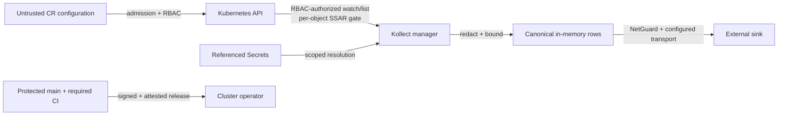

# Security assurance case

This assurance case summarizes why Kollect's security claims are credible and where they stop. The
adopter-facing control description is [Security architecture and controls](security/security-architecture.md);
the private-reporting process remains in [SECURITY.md](https://github.com/platformrelay/kollect/blob/main/SECURITY.md).

**Last reviewed:** 2026-07-31 against implementation snapshot `65047b1ac`.

**Scope:** manager, pipeline CLI, CRDs and webhooks, Helm chart, sink transports, CI, and release flow.

This is a structured engineering argument, not an external audit or certification.

## Claims

| Claim | Argument | Primary evidence |
| --- | --- | --- |
| Kubernetes reads are bounded by authorization | Generated RBAC bounds manager list/watch; controller SSAR gates per-object processing; tenant mode and watch namespaces reduce breadth | `config/rbac/`, `internal/collect/access.go`, `internal/inventory/auth.go`, `hack/audit-rbac.sh` |
| Tenant configuration cannot silently expand policy | `KollectScope`, admission, same-namespace references, and SAR checks layer application policy over Kubernetes RBAC | `internal/scope/`, `internal/validation/`, tenancy envtests |
| Credentials need not appear in CR data | Sink credentials and CA material use `secretRef`; secret-like generic options are rejected; backends receive resolved data in memory | `api/v1alpha1/sink_common_types.go`, `internal/validation/sink_config.go`, sink constructors |
| Exported data is minimized before leaving the manager | Secret-data paths are guarded; scrub keys and resource pruning run before rows reach sinks; status holds summaries and references | `internal/validation/profile.go`, `internal/collect/scrub.go`, ADR-0303, ADR-0405 |
| Sink endpoints are treated as untrusted | Literal endpoint checks are repeated after DNS resolution at dial time; private reachability is default-off and always-blocked targets remain denied | `internal/validation/endpoint_guard.go`, `internal/sink/netguard/`, resolved-address tests |
| The pod starts with a restrictive runtime profile | Helm defaults are non-root, seccomp `RuntimeDefault`, read-only root, no privilege escalation, dropped capabilities, and bounded ephemeral storage | `charts/kollect/values.yaml`, Helm unit tests |
| Published artifacts can be traced to reviewed history | Release eligibility checks protected-main ancestry and required CI; artifacts are scanned, signed, checksummed, SBOM'd, and attested | `hack/release/verify-eligibility.sh`, `.github/workflows/release.yaml`, ADR-0705 |

## Trust-boundary argument

The manager is trusted to enforce policy but is not treated as harmless: a compromise inherits the
service account's readable objects, referenced sink credentials, and network reachability. The
design therefore combines least privilege, access review, data minimization, endpoint controls,
runtime restrictions, and verifiable delivery rather than relying on one boundary.

## Countermeasure matrix

| Threat | Preventive controls | Detective / verification controls | Residual risk |
| --- | --- | --- | --- |
| Cross-namespace or cross-tenant export | RBAC, SAR/SSAR, `KollectScope`, namespace limits | envtest denial paths, `task audit:rbac` | An authorized policy author can still select sensitive data |
| Credential leakage | `secretRef`, inline secret-key rejection, scrubber, bounded status | logcheck, gitleaks, CodeQL, redaction tests | Key-based scrubbing cannot classify every business-sensitive value |
| SSRF / metadata access | Admission endpoint guard, resolved-address NetGuard, metadata hostname and CIDR denials | netguard/admission matrices, connection tests | `allowPrivateSinks` intentionally exposes reachable private services |
| MITM or wrong sink identity | TLS verification by default, CA references, SSH host-key verification | backend integration tests | Explicit insecure compatibility fields can weaken identity checks |
| Privilege escalation through deployment | Non-root, seccomp, read-only root, no capabilities, audited RBAC | Helm tests, Polaris, kubeaudit | Cluster policy may allow an operator to override chart defaults |
| Dependency or source compromise | Renovate, govulncheck, OSV, CodeQL, pinned Actions and scanner checksums | CI gates, OpenVEX and checked-in exception rationale | No scanner proves absence; accepted exceptions require periodic review |
| Artifact substitution | protected-main release eligibility, cosign, checksums, SBOM, SLSA provenance | `cosign verify`, `gh attestation verify` | Trust still depends on GitHub/Sigstore identities and maintainer account security |

## Evidence quality and limitations

- Unit, envtest, integration, Helm, smoke, and release-script tests are stronger evidence than prose.
- CI results prove the checked revision passed configured gates; they do not prove production
  configuration or runtime behavior.
- `task audit:rbac` checks generated manifests for dangerous permissions but cannot determine which
  arbitrary workload GVKs an adopter will grant.
- NetGuard constrains address classes and DNS rebinding; it does not authenticate an allowed
  private service.
- The chart does not ship a sink-aware egress `NetworkPolicy`. Deployers must provide one.
- External-sink encryption at rest, retention, deletion, backup, service authorization, and
  credential rotation remain adopter responsibilities.
- The optional read API adds a network surface when enabled; it is off by default and uses
  Kubernetes authentication by default, while a development-only disabled-auth mode also exists.
- Validating webhooks are enabled by default; disabling them removes the admission-time controls
  from this argument.

## Evidence and review cadence

| Evidence | Location |
| --- | --- |
| Security controls and verification | [Security architecture and controls](security/security-architecture.md) |
| Dated review and open findings | [Security review](SECURITY-REVIEW.md) |
| Core security decision | [ADR-0104](adr/0104-security-model.md) |
| Resolved-address enforcement | [Resolved-address policy](security/resolved-address-policy.md) |
| Vulnerability and license handling | [SCA remediation policy](security/sca-remediation-policy.md) |
| VEX dispositions | [OpenVEX](security/vex.json) |
| Release verification | [Release guide](RELEASE.md#verify-after-release) |

Re-review this case after changes to RBAC, tenancy, sensitive-data handling, endpoint policy, sink
transports, runtime security context, CI permissions, or release publication.
