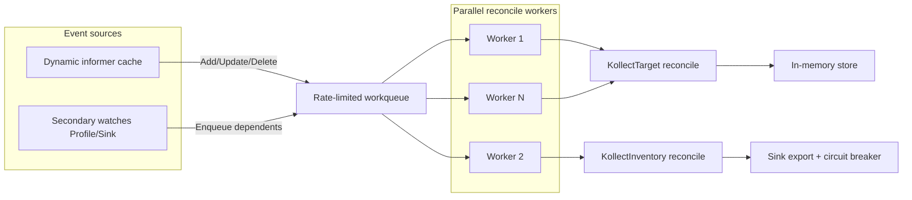

# ADR-0026: Performance and scalability

## Status

Accepted

## Context

kollect must run on production clusters with **10,000+ watched objects** across many GVKs,
namespaces, and targets without exhausting memory, API-server quota, or a single reconcile worker.
Platform teams need predictable operator footprint and observable bottlenecks before scaling to
~60 clusters ([ADR-0022](0022-multi-cluster-sync-rfc.md)).

Prior art:

- **kube-state-metrics** — shared informer per GVK, path-based extraction; memory scales with
  watched objects; exposes cache metrics.
- **controller-runtime** — workqueue decouples events from reconcile; `MaxConcurrentReconciles`
  enables parallel workers; built-in rate limiting and exponential backoff on errors.
- **external-secrets / Flux** — circuit breakers and typed errors prevent one bad backend from
  stalling the entire operator ([ADR-0020](0020-error-taxonomy.md)).

Default `task test` runs on developer laptops and CI runners with limited RAM. Unbounded load tests
(10k synthetic objects) must never run by default.

## Decision

### Scale targets

| Target | Requirement |
| --- | --- |
| Watched objects | **10,000+** per operator instance (scoped by selectors) |
| Memory | **Bounded** — scoped informers, paginated `List`, no full payload in etcd ([ADR-0006](0006-etcd-limit.md)) |
| API load | Event-driven informers only; long resync as correctness backstop ([ADR-0014](0014-event-driven-informers.md)) |
| Reconcile throughput | Parallel workers; per-controller rate limits; no head-of-line blocking on SAR degradation |

### Parallelism

1. **`MaxConcurrentReconciles`** — expose `--max-concurrent-reconciles` (default tuned for single
   cluster; Helm `values.yaml` documents override). Separate defaults per controller kind
   (`KollectTarget`, `KollectInventory`) where reconcile cost differs.
2. **Workqueue tuning** — controller-runtime rate limiter on requeue; exponential backoff + jitter
   for `ErrTransient` ([ADR-0020](0020-error-taxonomy.md)). Document queue depth metrics for tuning.
3. **Shard by namespace / GVK** — prefer **shared informer per GVK** across targets in the same
   namespace scope ([ADR-0014](0014-event-driven-informers.md)); optional future shard: one
   operator Deployment per `KollectScope` tenant for hard isolation at scale.
4. **`maxConcurrentWatches`** — soft cap on dynamic GVK informers with warning Event when approached
   ([ADR-0015](0015-static-vs-reconciled.md)).

### Observability

1. **pprof** — optional HTTP server on `:6060`, gated by feature flag / Helm value
   (`pprof.enabled`, default `false`). Bind localhost in production unless explicitly exposed for
   short-lived debug sessions.
2. **Prometheus metrics** (extend [ADR-0020](0020-error-taxonomy.md)):

| Metric | Labels | Purpose |
| --- | --- | --- |
| `kollect_reconcile_total` | `controller`, `result` | Throughput |
| `kollect_reconcile_errors_total` | `kind`, `error_class` | Failure mix |
| `kollect_reconcile_duration_seconds` | `controller` | Latency histogram |
| `kollect_workqueue_depth` | `controller` | Backpressure signal |
| `kollect_workqueue_latency_seconds` | `controller` | Queue wait time |
| `kollect_informer_cache_objects` | `gvk` | Memory / watch scope |
| `kollect_collected_objects` | `profile`, `gvk` | Collection counts |

3. **Performance tracking** — operator tuning guide in [PERFORMANCE.md](../PERFORMANCE.md); benchmark
   and load-test results recorded in CI artifacts when opt-in jobs run.

### Testing strategy

| Tier | Scope | Default CI / dev |
| --- | --- | --- |
| Go benchmarks | `BenchmarkExtract` (CEL/JSONPath hot path) | `task bench` (`-short`, `-benchmem`) |
| envtest synthetic objects | Controller reconcile with generated unstructured objects | **Cap 500** objects in default `task test` |
| Load tests (`-tags=load`) | End-to-end collection + export path | **Opt-in only**: `KOLECT_LOAD_TEST=1 task load-test`, max **2000** objects |
| kind bounded smoke | Helm install + sample CRs + metrics scrape | Nightly / manual e2e |

Rules:

- **Never** run 10k-object tests in default `task test` or PR CI.
- Benchmarks use `-short` to skip long sub-benchmarks on laptops.
- Load tests require explicit env flag and build tag; document in [DEVELOPMENT.md](../DEVELOPMENT.md).

### Dev machine safety

| Command | Purpose | Safe default |
| --- | --- | --- |
| `task test` | Unit + envtest (≤500 synthetic objects) | Yes — always |
| `task bench` | Micro-benchmarks only | Yes — `-short` |
| `task load-test` | Synthetic scale test (≤2000 objects) | **No** — requires `KOLECT_LOAD_TEST=1` |

### Failure tolerance

Align with [GUIDELINES.md](../../GUIDELINES.md) and [ADR-0020](0020-error-taxonomy.md):

- **Rate limiter** on workqueue requeue — prevents hot loops on transient API/sink errors.
- **Requeue backoff** with jitter for `ErrTransient`; **no requeue** for `ErrTerminal`.
- **Circuit breaker** (`gobreaker`) per sink backend — open circuit skips export attempts without
  blocking unrelated targets.
- **SAR degrade, not block** — `ErrForbidden` narrows list/watch scope and records
  `skipped:forbidden`; other targets in the queue continue reconciling.

## Consequences

### Positive

- Clear scale target (10k+ objects) drives informer sharing, scoped watches, and parallel workers.
- Bounded test tiers protect dev machines and CI while still allowing opt-in scale validation.
- pprof + queue/cache metrics give a standard playbook for production tuning.

### Negative

- Additional metrics increase cardinality if GVK labels are unbounded — cap label sets and
  aggregate where needed.
- Load tests behind tags/flags require discipline to run before major perf changes.
- Shared-informer-per-GVK vs per-target isolation remains a trade-off ([ADR-0014](0014-event-driven-informers.md)).

## Open questions

- **OPEN:** Default `MaxConcurrentReconciles` per controller — start at 5 or scale with CPU limit?
- **OPEN:** Reconcile-duration histogram buckets — fixed vs configurable via Helm?
- **OPEN:** Operator-per-tenant (`KollectScope` shard) vs single cluster-wide Deployment at 10k+ scale?

## See also

- [PERFORMANCE.md](../PERFORMANCE.md) — tuning guide
- [REQUIREMENTS.md](../REQUIREMENTS.md) — performance NFRs
- [ADR-0014](0014-event-driven-informers.md) — event-driven collection
- [ADR-0020](0020-error-taxonomy.md) — error taxonomy and metrics baseline
