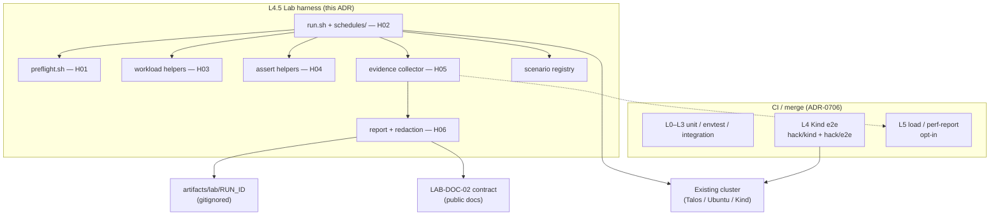

# ADR-0707: Lab harness architecture (maintainer multi-node / existing-cluster evidence)

> How Kollect encodes **resumable, schedule-driven lab runs** against an **existing** kubeconfig
> (driving-range Talos or local laptop), emits **LAB-DOC-02-compatible** evidence, and stays
> **outside** Kind L4 merge gates and L5/100k load claims — without overbuilding a full A–G
> catalogue harness before the proven `quick` / `quick+sinks` path is machine-encoded.

**Theme:** 07 · Project & meta · **Status:** Exploring

## Context

Maintainer multi-node evidence today is **hand-run**: protocols under gitignored
`agent-context/lab-protocols/`, artefacts under `artifacts/lab/<RUN_ID>/`. Repeated
`quick+sinks` runs (latest `dr-20260805-cd33ee` on **v0.16.0**) prove HA, ClusterIP sinks with
`allowPrivateSinks`, GitHub/GitLab export, and idle pprof — with most of the DR catalogue
**SKIPPED by operator judgment**, not by a coded stop rule. Behaviour is summarised in the
[lab evidence bundle](../operator-manual/lab-evidence-bundle.md) example.

Two design pressures collide:

1. **Ubuntu plan §10** proposed LAB-H01..H10 under `hack/lab/` (preflight → report → backends →
   failure inject → golden schema → Kind pprof).
2. **LAB-DOC-02** already shipped the **publishable** manifest / matrix / limitations / redaction
   contract. Automating a compatible layout is harness work; inventing a thicker machine bundle
   than DOC-02 is not a prerequisite for DOC-01.

Merge-gate architecture ([ADR-0706](0706-testing-merge-gate-architecture.md)) already owns:

| Tier | Role |
| --- | --- |
| **L4 Kind e2e** | Wiring smoke — `hack/kind/e2e/`, `hack/e2e/`; Tier 0 blocks merge |
| **L5 load** | Opt-in `task load-test` (≤2000), `task perf-report`; not merge-blocking |
| **100k cloud** | Separate runbook / `hack/loadtest/` — unexecuted claim gate |

The lab harness must **not** become a Kind wrapper, a second CI pyramid, or a public claim that
`quick+sinks` equals `full-lab-day` / Ubuntu D-suite / 100k.

### Forces

- Non-Kind kubeconfig is **first-class** (driving-range); Kind is one consumer, not the product.
- Offline **meta-tests** must merge without live `kubectl`/`helm`; live runs are operator-authorised.
- Cost: smallest footprint; tear down lab remotes/backends after each serial Wave 2b step.
- Evidence must satisfy LAB-DOC-02 fields (and may emit richer machine files later without
  widening public claims).
- Reuse `hack/e2e/*`, `hack/kind/*`, `hack/loadtest/*`, `hack/perf-report.sh`, Taskfile patterns —
  compose, don't fork.

## Options considered

### (a) Shell-first vs Go CLI

| Option | Pros | Cons |
| --- | --- | --- |
| **A1 Shell-first under `hack/lab/`** | Matches existing e2e/kind scripts; easy meta-tests (`hack/test/*`); zero new binary surface; agents already operate this way | Harder typed contracts; careful quoting/idempotency |
| **A2 New Go CLI (`kollect-lab`)** | Strong types, shared with product test helpers | Build/release surface; duplicates shell ops; slowest path to DOC-01 |
| **A3 Hybrid (Go library + thin shell)** | Best of both later | Premature abstraction before scenarios stabilize |

### (b) Kind-wrapper vs cluster-agnostic kubeconfig

| Option | Pros | Cons |
| --- | --- | --- |
| **B1 Kind-only wrapper** | Familiar CI path | **Rejects** driving-range (primary multi-node value); contradicts BACKLOG |
| **B2 Cluster-agnostic (`KUBECONFIG` + context)** | First-class Talos/Ubuntu/any existing cluster; never recreate cluster | Must refuse ambiguous contexts; isolation labels mandatory |
| **B3 Dual runners** | Specialize per platform | Double maintenance; schedule drift |

### (c) How schedules map to scenario IDs

| Option | Pros | Cons |
| --- | --- | --- |
| **C1 LAB-\* only (Ubuntu catalogue)** | Single ID space from plan §6 | DR runs already use DR-\*; docs example uses DR-\* |
| **C2 DR-\* only** | Matches proven protocols | Ubuntu A–G catalogue orphans |
| **C3 Registry: schedule → primary IDs + aliases** | DR-\* primary for multi-node; LAB-\* aliases for Ubuntu mapping | Small registry file to maintain |

### (d) Relationship to Kind L4 / loadtest L5

| Option | Pros | Cons |
| --- | --- | --- |
| **D1 Lab replaces Kind e2e** | One path | Breaks merge determinism; needs live cluster |
| **D2 Lab is maintainer L4.5 evidence tier** | Clear claims boundary; CI stays Kind | Operators must learn two paths |
| **D3 Lab subsumes L5 / 100k** | One scale story | Conflates laptop/Talos with cloud claim gate |

## Weighted trade-offs

Weights are subjective maintainer priorities for **this** decision (cost / DOC-01 unblock >
completeness). Scores 1–5 (higher better). Winner = highest weighted sum.

| Criterion (weight) | A1 Shell | A2 Go CLI | B2 Agnostic | B1 Kind-only | C3 Registry | C1 LAB-only | D2 L4.5 | D1 Replace L4 |
| --- | ---: | ---: | ---: | ---: | ---: | ---: | ---: | ---: |
| Time-to-DOC-01 (5) | 5 | 2 | 5 | 1 | 5 | 3 | 5 | 1 |
| Reuse of `hack/*` (4) | 5 | 2 | 4 | 5 | 4 | 3 | 5 | 2 |
| Multi-node fidelity (5) | 4 | 4 | 5 | 1 | 5 | 2 | 5 | 3 |
| Merge without live cluster (5) | 5 | 4 | 5 | 5 | 5 | 5 | 5 | 1 |
| Operability / agent fit (3) | 5 | 3 | 5 | 3 | 4 | 4 | 5 | 2 |
| Long-term typed rigor (2) | 2 | 5 | 3 | 3 | 4 | 3 | 4 | 3 |
| **Weighted sum** | **91** | **62** | **95** | **55** | **93** | **66** | **100** | **36** |

**Winners:** A1 shell-first; B2 cluster-agnostic; C3 schedule registry; D2 lab as L4.5. Numbers for
“typed rigor” and “agent fit” are the most subjective.

## Decision

**We chose a thin-slice, shell-first, cluster-agnostic lab harness under `hack/lab/` that encodes the
proven `quick` / `quick+sinks` schedules with resume, serial backend orchestration, and LAB-DOC-02-
compatible evidence output — accepting deferred H07/H08 generality and incomplete Ubuntu A–G
automation — over a full H01–H10 catalogue harness or a Go CLI, which would delay DOC-01 and
duplicate Kind L4 without stopping judgment-driven skips.**

Binding points:

1. **Scope v1 (gate for LAB-DOC-01):** H01–H06 — preflight, resumable runner + schedule registry,
   minimal workload helper, assert helpers, evidence collector, report/redaction. Schedules:
   `quick`, `quick+sinks` (required); `full-lab-day` / `soak` may exist as **declared** presets that
   refuse to run until capacity gates and scenario scripts exist (explicit `BLOCKED` / refuse, not
   silent skip-as-pass).
2. **Scenario IDs:** checked-in registry maps schedule → ordered DR-\* (and LAB-\* aliases). Skip
   reasons must be **machine-emitted** (`LIMIT_REACHED`, `BLOCKED`, schedule-exclusion) with a
   reason string — never an empty cell that looks green.
3. **Kubeconfig:** discover/reuse existing context; **never** create/destroy the cluster; isolation
   via `kollect.dev/lab-run=<RUN_ID>`, namespaces `kollect-lab-<RUN_ID>-*`, release `kollect-lab`
   (align Ubuntu §2 / DR Wave 0).
4. **Evidence:** write `artifacts/lab/<RUN_ID>/` such that a redacted summary can satisfy
   [lab-evidence-bundle.md](../operator-manual/lab-evidence-bundle.md) (manifest fields, scenario
   rows, limitations, redaction). Richer JSON/JUnit/CSV are **allowed** but not required to exceed
   DOC-02 for v1.
5. **CI:** meta-tests only (`hack/test/lab_*`). No live kubectl/helm in PR CI. Live runs are
   maintainer-authorised and non-blocking.
6. **Defer:** H07 general backend-profile framework; H08 failure injector; claiming public wording
   beyond what a named schedule’s protocol actually PASS’d — **not claimed until `full-lab-day`
   (or a later named schedule) lands a green-enough protocol**.
7. **H10 / PERF-LAB-01:** shares H05 capture helpers; Kind-oriented entrypoint may land in parallel
   after H05, not on the DOC-01 critical path.

### Lab harness vs CI pyramid

## Consequences

### Enables

- LAB-DOC-01 can document real flags (`--schedule`, `--resume`, `--tier`, `--run-id`, `--keep-lab`)
  against a checked-in runner instead of aspirational prose.
- Catalogue coverage stops depending on “agent remembered Wave 2b tear-down”; serial orchestration
  and schedule membership are code.
- Driving-range and Ubuntu share one harness contract; Kind remains the merge-gate path.

### Forecloses / accepts

- No Go `kollect-lab` in v1; no claim that H01–H06 equals full Ubuntu Phase D/F or DR Wave 1.3–1.5.
- `full-lab-day` public language remains forbidden until that schedule is implemented **and** a
  protocol exists (see Non-goals).
- H07/H08 absence means LAB-DOC-04/05 may start from registry + manual fidelity notes, then deepen
  when backend/inject scripts land.

### Follow-ups

- Story slices LAB-H01..H06 → LAB-DOC-01; H09 thin goldens with H06; H07/H08 later; H10 ↔ PERF-LAB-01.
- When H01 merges, flip this ADR **Exploring → Current**.
- Maintainer-LGTM if harness ever gains CRD API or default-on network egress beyond lab namespaces
  (not expected).

## Non-goals (binding language)

- **Not a merge gate.** Lab success never blocks PR merge; Kind L4 remains canonical CI e2e.
- **Not 100k / two-cluster proof.** Laptop or Talos lab evidence must not be worded as satisfying
  `docs/operator-manual/load-test-runbook.md` cloud gates.
- **Not claimed until `full-lab-day`:** workload spread, worker drain, Cilium NetPol, full Wave 2b
  remainder, Wave‑4 Tier‑S converge/churn pprof, certificate-count parity, Ubuntu D-suite, managed-
  SaaS sink parity. `quick+sinks` may only support **READY WITH CONDITIONS**-shaped public text
  naming what PASS’d and listing limitations (per LAB-DOC-02).
- **Do not commit** protocols, raw artefacts, kubeconfigs, or tokens.
- **Do not** invent thin Track‑A coverage chips in this workstream.
- **Do not** expand into DEMO-04, COV, INV-TENANCY, or release cutting via this ADR.

## Cross-links

- [ADR-0706: Testing and merge-gate architecture](0706-testing-merge-gate-architecture.md) — L4 Kind /
  L5 load ownership; this ADR sits beside them as maintainer **L4.5**.
- [Lab evidence bundle](../operator-manual/lab-evidence-bundle.md) — LAB-DOC-02 publishable schema and
  redaction contract the harness must satisfy.
