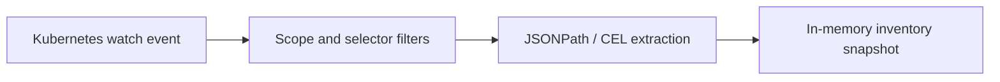

# How collection works

Kollect registers shared dynamic informers for the GVKs declared by active profiles. Events pass
through namespace, watch-mode, label, and field filters before JSONPath or CEL extraction produces
deterministically ordered rows.

The operator is level-based: a reconcile recomputes desired state from observed state, while a
long resync is only a correctness backstop. Missing optional attributes are omitted; required
extraction failures surface in target conditions and events.

See [ADR-0301](../adr/0301-event-driven-informers.md),
[ADR-0302](../adr/0302-cel-jsonpath-extraction.md), and
[annotations and labels](../ANNOTATIONS-LABELS.md).
