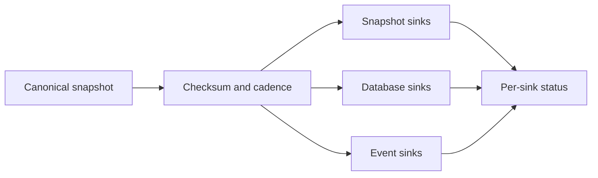

# Export pipeline and debouncing

Each inventory owns one deterministically ordered snapshot. It fans that snapshot out through
three explicit reference lists:

- `snapshotSinkRefs` for Git, GitLab, S3, and GCS;
- `databaseSinkRefs` for Postgres, MongoDB, and BigQuery;
- `eventSinkRefs` for Kafka and NATS.

Those nine backend types are the current enums in the generated family-sink CRD schemas. A failed
destination does not erase successful exports to the others; per-destination results live in
`status.sinkExports[]`.

## Debounce and interval precedence

Collection updates the in-memory snapshot immediately. Export reconciles after material changes
and suppresses redundant writes per sink. The effective minimum interval is resolved in this order:

1. `exportMinInterval` on the inventory's family-sink reference;
2. `spec.exportMinInterval` on that family sink;
3. `KollectInventory.spec.exportMinInterval`;
4. the `KollectScope.spec.minExportInterval` floor.

A changed checksum or generation is eligible for immediate export. An unchanged snapshot waits for
the effective interval; `0s` means material-change-only export. The scope floor can only make writes
less frequent.

## Connection lifecycle

Family sinks can probe connectivity during reconciliation and report `ConnectionVerified`.
`KollectConnectionTest` provides an auditable one-shot probe with a completion TTL. Connectivity is
separate from inventory `Synced`: a reachable backend can still reject an export payload.

## Related concepts

- [How collection works](collection.md) — informer, filters, and extraction.
- [Multi-tenancy and scopes](multi-tenancy.md) — GVK, namespace, sink, and cadence policy.
- [Multi-cluster fleet](multi-cluster.md) — cluster-partitioned shared destinations.
- [ADR-0413](../adr/0413-export-interval-scheduling.md) — scheduling semantics.
- [Conditions and status](../reference/conditions.md) — operational interpretation.
