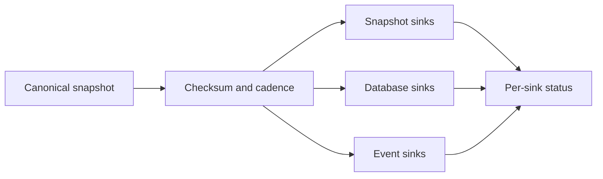

# Export pipeline and debouncing

Each inventory owns one deterministically ordered snapshot. It fans that snapshot out through
three explicit reference lists:

- `snapshotSinkRefs` for Git, GitLab, S3, and GCS;
- `databaseSinkRefs` for Postgres, MongoDB, and BigQuery;
- `eventSinkRefs` for Kafka and NATS.

Those nine backend types are the current enums in the generated family-sink CRD schemas. A failed
destination does not erase successful exports to the others; per-destination results live in
`status.sinkExports[]`.

## Debounce and interval precedence

Collection updates the in-memory snapshot immediately. Export reconciles after material changes
and suppresses redundant writes per sink. The effective minimum interval is resolved in this order:

1. `exportMinInterval` on the inventory's family-sink reference;
2. `spec.exportMinInterval` on that family sink;
3. `KollectInventory.spec.exportMinInterval`;
4. the `KollectScope.spec.minExportInterval` floor.

A changed checksum or generation is eligible for immediate export. An unchanged snapshot waits for
the effective interval; `0s` means material-change-only export. The scope floor can only make writes
less frequent.



## Multipart export completeness

When a snapshot exceeds the effective `maxExportBytes` ceiling it is sharded into several bounded
parts written one after another (a size-sharded set is not written atomically). For JSON state sinks
each part's envelope carries a `partIndex`/`partTotal`/`generation` marker; for the default **Git/GitLab
YAML** projection the data files carry no envelope metadata, so a multipart `perResource`/`split` set
instead carries a **per-set manifest sidecar** ([ADR-0405](../adr/0405-export-data-contract.md),
[ADR-0419](../adr/0419-git-export-serialization-layout.md)).

For a 3-part YAML export of `partitioned-inventory` at generation 7 the committed tree is:

```text
inventory/
  default/
    partitioned-inventory.manifest.json   # per-set sidecar (JSON, machine-readable)
default/                                   # perResource data tree
  team-a/
    Deployment/
      api.yaml                             # part 1
      web.yaml                             # part 2
      worker.yaml                          # part 3
```

The sidecar declares `generation`, `partTotal`, the per-part identifiers, and the **union** of every
part's data-file `paths`. It is written once, on the final part, and rides that part's single
union-prune keep-set, so every part's files and the manifest survive; a new-generation re-export
replaces it in place (its path has no generation placeholder). Its `.manifest.json` extension is
distinct from the `.yaml` data files, so an existing consumer globbing `inventory/<ns>/*.yaml` skips it.
A single-part export writes **no** sidecar and stays byte-identical to a non-partitioned export. The
`config/samples/advanced/kollect_v1alpha1_kollectinventory_export-partitioning.yaml` sample shows the full
manifest, and the operator manual explains how to confirm a set is complete from it.

## Connection lifecycle

Family sinks can probe connectivity during reconciliation and report `ConnectionVerified`.
`KollectConnectionTest` provides an auditable one-shot probe with a completion TTL. Connectivity is
separate from inventory `Synced`: a reachable backend can still reject an export payload.

## Related concepts

- [How collection works](collection.md) — informer, filters, and extraction.
- [Multi-tenancy and scopes](multi-tenancy.md) — GVK, namespace, sink, and cadence policy.
- [Multi-cluster fleet](multi-cluster.md) — cluster-partitioned shared destinations.
- [ADR-0413](../adr/0413-export-interval-scheduling.md) — scheduling semantics.
- [Conditions and status](../reference/conditions.md) — operational interpretation.
