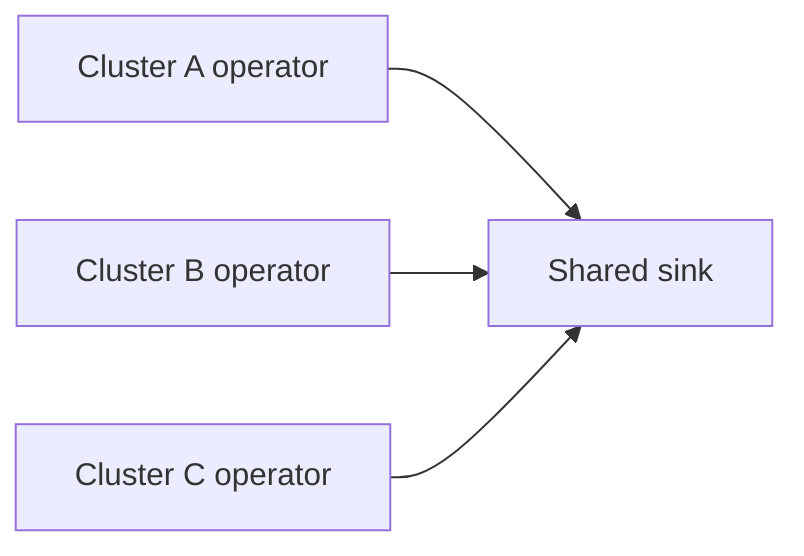

# Multi-cluster fleet

Kollect uses one ordinary operator per cluster. Operators write to a shared sink and partition
rows by `spec.cluster`; there is no hub controller or ingest tier to operate.

Use unique cluster identifiers and a layout that prevents writers from contending for the same
path. For relational stores, include the cluster dimension in keys and indexes. Git fleets should
partition paths and choose a cadence that avoids needless repository lock contention.

Snapshot layouts use `{cluster}` in their path templates. Database rows include cluster in their
identity, and event consumers receive the same dimension. CR status keeps only summaries; there is
no in-cluster aggregation tier or cross-cluster control plane.

See [ADR-0501](../adr/0501-multi-cluster-fleet.md) and the
[multi-cluster example](../examples/multi-cluster-fleet.md).
