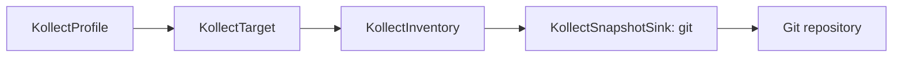

# Your first inventory

Collect container images from a Deployment, export them to a Git repository, and inspect the
result as an ordinary Git diff.

> **Prerequisite:** a running operator from [Install Kollect](install.md) and an empty Git
> repository you can push to. Use a disposable repository for this evaluation.

## 1. Prepare Git credentials

Set the HTTPS clone URL and a token with write access. Credentials stay in a Kubernetes Secret;
they never appear in a Kollect custom resource.

```sh
export KOLLECT_DEMO_REPO=https://github.com/YOUR-ACCOUNT/kollect-inventory-demo.git
read -rsp "Git token: " KOLLECT_DEMO_TOKEN; echo
kubectl -n default create secret generic git-push-credentials \
  --from-literal=username=git \
  --from-literal=password="$KOLLECT_DEMO_TOKEN"
unset KOLLECT_DEMO_TOKEN
```

## 2. Apply the four-resource pipeline

The manifests below use the repository-validated profile, target, inventory, and
`KollectSnapshotSink` with `type: git`.
Copy the sample to a temporary directory and replace only its endpoint and credential reference:

```sh
demo_dir="$(mktemp -d)"
cp config/samples/demo/git-only/{profile,target,inventory,sink}.yaml "$demo_dir/"
sed -i.bak "s|http://forgejo.forgejo.svc.cluster.local:3000/kollect/inventory-demo.git|$KOLLECT_DEMO_REPO|" \
  "$demo_dir/sink.yaml"
sed -i.bak 's/name: hero-git-credentials/name: git-push-credentials/' "$demo_dir/sink.yaml"
kubectl apply -f "$demo_dir/profile.yaml" -f "$demo_dir/target.yaml" \
  -f "$demo_dir/sink.yaml" -f "$demo_dir/inventory.yaml"
```

The pipeline is:



## 3. Create something to collect

The sample target watches `demo` for Deployments labeled `app=shop`.

```sh
kubectl create namespace demo --dry-run=client -o yaml | kubectl apply -f -
kubectl -n demo create deployment storefront --image=nginx:1.27
kubectl -n demo label deployment storefront app=shop
```

## Verify

Wait for the sink and inventory, then inspect the per-sink export status:

```sh
kubectl -n default wait --for=condition=ConnectionVerified \
  kollectsnapshotsink/hero-git-sink --timeout=90s
kubectl -n default wait --for=condition=Ready \
  kollectinventory/demo-inventory --timeout=90s
kubectl -n default get kollectinventory demo-inventory \
  -o jsonpath='{.status.sinkExports}' ; echo
```

Clone the exported repository and save the first revision:

```sh
git clone "$KOLLECT_DEMO_REPO" kollect-inventory-output
cd kollect-inventory-output
git log --oneline -1
git show --stat --oneline HEAD
first_export="$(git rev-parse HEAD)"
```

Now change the observed Deployment and wait for the next export:

```sh
kubectl -n demo set image deployment/storefront nginx=nginx:1.28
sleep 20
git pull --ff-only
git diff "$first_export"..HEAD
```

The diff is the result: a deterministic inventory file records the image change without querying
the live cluster. The default sample path is
`namespaces/demo/Deployment/storefront.yaml`.

## If it didn't work

| Symptom | Fix |
| --- | --- |
| `ConnectionVerified=False` | Check the repository URL, token scope, and Secret keys with `kubectl describe ksnap hero-git-sink`. |
| Inventory has zero items | Confirm the Deployment is in `demo` and has `app=shop`. |
| No second commit | Wait at least the configured 15-second export interval and inspect manager logs. |
| Push is rejected | Start with an empty repository, or allow a fast-forward commit to its configured `main` branch. |

See [Troubleshooting](../operator-manual/troubleshooting.md) for condition and event diagnostics.

## Clean up

```sh
cd ..
kubectl delete -f "$demo_dir/profile.yaml" -f "$demo_dir/target.yaml" \
  -f "$demo_dir/sink.yaml" -f "$demo_dir/inventory.yaml"
kubectl delete namespace demo
kubectl -n default delete secret git-push-credentials
```

## Further reading

- [Git export layout](../adr/0419-git-export-serialization-layout.md)
- [Snapshot sink reference](../crds/kollectsnapshotsink.md)
- [All examples](../examples/README.md)
