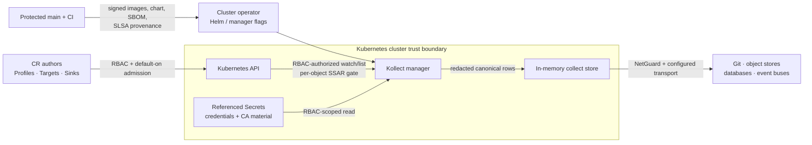

# Security architecture and controls

Kollect reads Kubernetes objects and exports selected data to systems outside the cluster. That
position gives the manager meaningful read access and makes every profile, selector, credential,
and sink endpoint security-relevant.

This page explains the controls that ship with Kollect, where they are enforced, what operators
must configure, and what risk remains. It is an engineering assurance summary, not a certification.

**Implementation anchor:** `65047b1ac` (2026-07-31, merged NET-01 implementation). The
[security review](../SECURITY-REVIEW.md) records the reviewed release anchor; this page must be
rechecked whenever the network, tenancy, credential, or release model changes.

## Security model at a glance

| Goal | Shipped control | Default | Operator responsibility |
| --- | --- | --- | --- |
| Limit Kubernetes reads | Generated least-privilege RBAC, `SelfSubjectAccessReview` / `SubjectAccessReview`, namespace watch limits | Cluster-wide install; `tenantMode: false` | Prefer tenant mode or explicit watch namespaces where cluster-wide inventory is unnecessary |
| Keep tenants within policy | Optional `KollectScope` reconciliation gates | No policy ceiling when a Scope is absent | Create Scopes where needed; restrict who can write Profiles, Scopes, Targets, Inventories, and Sink CRs |
| Keep credentials out of API data | Sink `secretRef`; secret-like inline options rejected | No inline credential fields | Use workload identity where supported and rotate referenced Secrets |
| Minimize exported sensitive data | Secret-data path guard, built-in and operator `scrubKeys`, resource-pruning rules, bounded status | Sensitive paths denied or redacted | Review every Profile; redaction is defense in depth, not data classification |
| Constrain outbound connections | Admission endpoint checks when webhooks are enabled, plus dial-time NetGuard | Webhooks on; public, globally routable network sink targets only | Add egress `NetworkPolicy`; enable private sinks only after accepting the documented SSRF trade-off |
| Protect transport | TLS-capable client settings verify by default; custom CA support | Verification on when TLS is configured | Require TLS in backend URLs/broker settings; do not use explicit insecure modes |
| Reduce pod privilege | Non-root, `RuntimeDefault` seccomp, read-only root filesystem, no privilege escalation, all capabilities dropped | Enabled in the Helm chart | Enforce equivalent Pod Security controls and resource limits in the target cluster |
| Make releases verifiable | Protected-main eligibility gate, CodeQL/SCA/secret/RBAC checks, Trivy, cosign, SBOM and SLSA provenance | Release workflow | Pin a version and verify signatures/attestations before deployment |

## Trust boundaries



The main boundaries are:

- **CR authors → manager:** CRs are untrusted configuration. Default-on admission rejects invalid
  extraction, inline secrets, unsupported sink types, unsafe literal endpoints, and invalid policy
  references. Disabling webhooks removes this pre-persistence layer.
- **Manager → Kubernetes API:** the service account can read only what RBAC permits. Access reviews
  prevent the manager from treating a requested cross-namespace read as authorization.
- **Manager → sink:** endpoint strings, DNS, redirects, and reconnects are untrusted. Address policy
  is repeated at dial time, after resolution, before opening a socket.
- **Collected object → export:** selected Kubernetes data can itself be sensitive. Scrubbing and
  pruning run before rows reach sinks; full payloads do not belong in CR status.
- **Build system → adopter:** source review is not enough if artifacts can be replaced. Release
  eligibility, signatures, attestations, checksums, and SBOMs bind artifacts to reviewed history.

## Kubernetes authorization and tenancy

Kollect does not grant itself permission to arbitrary target GVKs. Generated Roles and ClusterRoles
cover Kollect CRDs, coordination, events, and the declared manager needs; `task audit:rbac` renders
and checks them with Polaris and kubeaudit.

The controller's dynamic informer lists and watches with the manager service account, so Kubernetes
RBAC is the hard boundary on what enters its cache. It evaluates `SelfSubjectAccessReview` before
processing each cached object. The pipeline CLI lists directly with the invoking kubeconfig and does
not add an SSAR layer. The optional HTTP read API uses bearer-token review plus
`SubjectAccessReview` for the requested inventory. A denial is handled as a scoped failure or
skipped resource, not as a reason to escalate.

`KollectScope` adds application-level tenancy constraints for allowed GVKs, namespaces, sinks, and
resource export. Scope enforcement is opt-in: when no Scope exists, it adds no policy ceiling.
When several Scopes exist in one namespace, the lexicographically first name wins; admission does
not enforce a singleton. Operate one Scope per namespace. Scope complements Kubernetes RBAC; it
does not replace it. The Helm chart also offers:

- `tenantMode: true`, which renders namespaced Role/RoleBinding resources and rejects cluster kinds;
- `watchNamespaces`, which bounds the manager cache and watch surface; and
- namespace include/exclude defaults, which reduce accidental collection breadth.

!!! important "The manager is a confused-deputy target"
    A principal who may write Sink or Inventory CRs can cause the manager to connect or export using
    the manager's network position and referenced credentials. Restrict CR write RBAC and Secret
    access even when `KollectScope` is enabled.

## Network egress and NetGuard

Kollect normally uses two layers for sink endpoint policy:

1. **Admission validation**, when webhooks are enabled, rejects explicit forbidden hosts, IP
   literals, and `file://` URLs.
2. **Dial-time NetGuard** resolves each hostname, validates the complete answer set, and connects to
   an approved numeric address. The decision is repeated for new connections, redirects, and backend
   reconnects, reducing DNS-rebinding and time-of-check/time-of-use exposure.

The guarded transports are used by Git/GitLab, S3 and its GCS-compatible path, Postgres, MongoDB,
BigQuery, Kafka, and NATS.

### Secure default

With no extra flag, private RFC1918 and IPv6 ULA addresses are denied at admission when literal and
at dial time after DNS resolution. Loopback, link-local, metadata, unspecified, multicast,
carrier-grade NAT, benchmark ranges, and known metadata hostnames are also denied for network
connections. Default-on admission separately rejects `file://` Git URLs.

The integration build tag has a broader test-only bypass for local testcontainers. Production
images do not enable that path.

### Private-sink opt-in

Some clusters export to in-cluster Postgres, MinIO, Kafka, or NATS services. A cluster operator can
set the Helm value `allowPrivateSinks: true`, which renders the manager flag
`--allow-private-sinks`.

The default is `false`. The setting is process-wide and install-time only—there is no CRD or tenant
field that lets a Sink author widen it. One startup value configures both admission and dial-time
policy so they do not intentionally diverge.

When enabled, only addresses classified as private (RFC1918 or IPv6 ULA) become eligible. TLS,
authentication, Kubernetes policy, and application authorization still apply.

### Always blocked

The private-sink opt-in does **not** permit:

- IPv4 or IPv6 loopback;
- link-local addresses, including `169.254.169.254`;
- known cloud-metadata hostnames;
- unspecified or multicast addresses;
- carrier-grade NAT (`100.64.0.0/10`);
- benchmark networks (`198.18.0.0/15`).

A DNS response containing both an allowed private address and an always-blocked address fails
closed.

`file://` is not a network address and therefore is outside NetGuard. Admission rejects it while
webhooks are enabled, but the Git backend accepts a valid local bare-repository path at runtime.
Disabling webhooks therefore removes the control that prevents a Sink CR from selecting a local
repository.

### Verification

```sh
# The secure default should be visible in chart output.
helm template kollect ./charts/kollect | rg -- '--allow-private-sinks' && exit 1

# The opt-in should render exactly one manager flag.
helm template kollect ./charts/kollect \
  --set allowPrivateSinks=true | rg -- '--allow-private-sinks'

# Unit matrices cover default deny, private opt-in, mixed DNS answers,
# metadata/link-local/loopback denial, and admission/dial-time parity.
go test ./internal/sink/netguard ./internal/validation ./cmd
task helm-test
```

See [Resolved-address policy](resolved-address-policy.md) for implementation detail.

### Residual risk

When private sinks are enabled, a Sink-CR author can direct connection tests and exports to private
or VPC services reachable from the manager pod. NetGuard is an address-class control, not service
identity or application authorization.

The chart does **not** currently ship an outbound egress `NetworkPolicy`; the scaffolded policy
protects metrics ingress only. Deployers should add namespace-appropriate egress rules for the
Kubernetes API, DNS, and approved sink destinations. This is the strongest compensating control for
the private-address opt-in.

Pure-Go HTTP clients disable proxy inheritance. Git CLI execution can inherit proxy variables from
the manager environment; proxy-based weakening is unsupported but is not centrally prevented.
Avoid injecting `HTTP_PROXY`, `HTTPS_PROXY`, or `ALL_PROXY` into the manager and use egress policy
as the enforcement boundary.

## Credentials and sensitive data

- Sink credentials are referenced through `secretRef`; secret-like keys in generic sink options are
  rejected. CA material can be inline or Secret-backed depending on the backend.
- Reconcilers resolve credentials and pass them to backend constructors in memory. Backends do not
  independently list arbitrary Secrets.
- Profile validation blocks direct extraction from `Secret.data` unless the explicit sensitive-data
  policy permits it.
- The scrubber redacts built-in sensitive key names plus operator and profile `scrubKeys` at any
  depth before export.
- Full inventory payloads go to sinks. CR status contains conditions, counts, summaries, and export
  references, not the inventory payload. `maxExportBytes` separately bounds serialized export and
  HTTP payloads.
- Git transports sanitize known credential values before errors reach status or Events. Other
  backend/library error strings are not centrally sanitized, so credential-free third-party errors
  remain an assurance gap. Custom `logcheck`, gitleaks, CodeQL, unit tests, and review provide
  defense in depth, but they cannot prove that a user-authored Profile contains no
  business-sensitive field.

Use workload identity or short-lived credentials where a backend supports them. Kubernetes Secret
encryption at rest, secret rotation, external secret management, and sink-side encryption are
deployment responsibilities.

## Transport security

Kollect does not force every backend to use TLS: Kafka broker configuration has no Kollect TLS
surface today, NATS enables TLS only when configured, and Postgres/MongoDB inherit transport policy
from their connection strings. Where Kollect constructs TLS configuration, certificate verification
is on by default and custom CA material is supported.

Some backends have explicit `insecureSkipVerify` compatibility fields; these are off by default and
weaken server authentication. They are not implied by `allowPrivateSinks`.

`spec.tls.insecureSkipVerify` is TLS-named but transport-scoped: it disables verification of the
remote's identity for whichever transport the sink's endpoint selects. For an `ssh://` Git remote
that means **SSH host-key verification is disabled too**, not only certificate checking. A sink has
one endpoint and therefore one transport, so the flag never applies to both at once. It is off by
default, sets the `TLSInsecure` status condition when enabled, and on the go-git path the secure
alternative fails closed: without the flag and without a `known_hosts` key in the sink's secret, the
export errors instead of falling back to trust-on-first-use. See
[ADR-0104](../adr/0104-security-model.md) and [ADR-0407](../adr/0407-git-object-store-layout.md).

Git SSH retains the original hostname for host-key verification while dialing the checked numeric
address — the address guard is independent of `insecureSkipVerify`, but with the flag set there is
no host-key check left for it to feed. Validating webhooks are enabled by default and the chart's built-in certificate path
requires cert-manager. Operators who disable chart-managed certificate resources must provision
compatible serving certificates and CA injection themselves. Kubernetes API identity and encryption
are delegated to the cluster.

The optional Read API is off by default. When enabled, its default `kubernetes` mode authenticates
and authorizes with TokenReview and SubjectAccessReview, but the built-in listener serves plain HTTP.
The `disabled` auth mode exists for local development and CI and must not be exposed. Supply
transport confidentiality with an ingress, service mesh, local port-forward, or equivalent network
boundary; do not send bearer tokens across an untrusted plaintext network.

Treat every insecure compatibility option as a temporary exception: limit its RBAC, record the
reason and expiry, and prefer a trusted CA or correct server certificate.

## Runtime hardening

The Helm defaults set:

- `runAsNonRoot: true`;
- `seccompProfile.type: RuntimeDefault`;
- `readOnlyRootFilesystem: true`;
- `allowPrivilegeEscalation: false`;
- `capabilities.drop: [ALL]`; and
- CPU, memory, and ephemeral-storage requests/limits.

The manager uses a dedicated service account and writable `emptyDir` storage only where runtime work
requires it. Admission policy or Pod Security enforcement should prevent downstream overrides from
weakening these settings. Availability controls such as disruption budgets and resource sizing are
operational safeguards, not isolation boundaries.

## CI/CD and supply chain

Code-affecting pull requests and protected-main release candidates are checked by the CI matrix
below. Some expensive code gates are path-filtered on docs-only changes; the documentation workflow
provides the docs build, lint, and link gates.

| Layer | Controls |
| --- | --- |
| Source and secrets | gitleaks, CodeQL, golangci-lint with gosec and project log checks |
| Dependencies | `govulncheck`, GitHub advisory alerts, Renovate update PRs, lockfiles; OSV configuration records reviewed audit exceptions |
| Kubernetes and artifacts | generated-manifest drift, RBAC audit, Helm tests, container build |
| Behavior | unit/envtest, integration, smoke, fuzz, and pipeline-CLI smoke jobs |
| Release eligibility | candidate SHA must be reachable from protected `main`, be a merged PR commit, and have the required checks |
| Publication | Trivy scan, cosign keyless signatures, SPDX SBOM, SLSA provenance, release checksums and signed bundles |

GitHub Actions use explicit token permissions and commit-pinned third-party actions. The gitleaks,
kubeaudit, Polaris, Helm, and ShellCheck installers verify upstream checksums or repository-recorded
digests; not every convenience-tool installer has the same guarantee. The release job receives
write and OIDC permissions only after eligibility and the protected `release` environment.

Kollect publishes an [OpenVEX document](vex.json) for reviewed vulnerability dispositions. Scanner
exceptions must also have a concrete reachability rationale and review trigger; see the
[SCA remediation policy](sca-remediation-policy.md). A VEX statement says how a known finding
affects a product—it does not remove the dependency or replace a scanner gate.

## Shared responsibility

| Kollect provides | Cluster operator provides | Sink owner provides |
| --- | --- | --- |
| Default-on admission, access reviews, scope enforcement, redaction primitives, guarded dialing, hardened chart defaults | Keep webhooks and Read API auth enabled outside local development; minimal install RBAC, CR-writer policy, Secret lifecycle, egress policy, Pod Security, upgrades, audit retention | TLS identity, service authorization, encryption at rest, retention/deletion, backup and recovery |

Kollect cannot prevent an authorized Profile author from selecting data that the manager may read
and that policy permits. Review Profiles and Sinks as data-export policy, not ordinary application
configuration.

## Verification checklist

```sh
# Source, generated contracts, tests, SAST, RBAC, and dependency reachability
task verify
task lint
task test
task audit:rbac
task vulncheck
task scrub

# Chart defaults and security contexts
task helm-test
helm template kollect ./charts/kollect > /tmp/kollect-rendered.yaml

# Release identity (replace the example tag/digest)
cosign verify \
  --certificate-oidc-issuer https://token.actions.githubusercontent.com \
  --certificate-identity-regexp '^https://github.com/platformrelay/kollect/.+' \
  ghcr.io/platformrelay/kollect@sha256:REPLACE_ME
```

Also verify the exact release SHA and required checks on GitHub, inspect the published SBOM and
attestation, and test access-denied behavior with the deployment's real service account.

## Limitations and residual risk

- Kollect is pre-1.0 and its `v1alpha1` API can change in minor releases.
- A compromised manager inherits its service-account reads, referenced credentials, and reachable
  network; least privilege and egress policy bound that blast radius.
- Redaction is key- and policy-driven. It does not discover all sensitive business data.
- Generic third-party backend error strings are not centrally credential-sanitized.
- Git CLI can inherit proxy environment variables; NetGuard is not a substitute for enforced
  egress policy.
- External sink authorization, encryption at rest, retention, deletion, and backups are not
  enforced by Kollect.
- The optional Read API expands the attack surface when enabled; its default auth does not add
  transport TLS, and its development-only disabled-auth mode removes request authentication.
- Disabling validating webhooks removes admission-time endpoint, inline-secret, extraction, and
  policy checks; runtime controls do not replace every admission rule.
- `allowPrivateSinks` intentionally widens reachable address space and should remain off unless
  private endpoints are required.
- Supply-chain evidence reduces artifact-substitution risk; it does not prove the absence of
  vulnerabilities or malicious reviewed code.

Report vulnerabilities privately through the repository
[security policy](https://github.com/platformrelay/kollect/blob/main/SECURITY.md).
