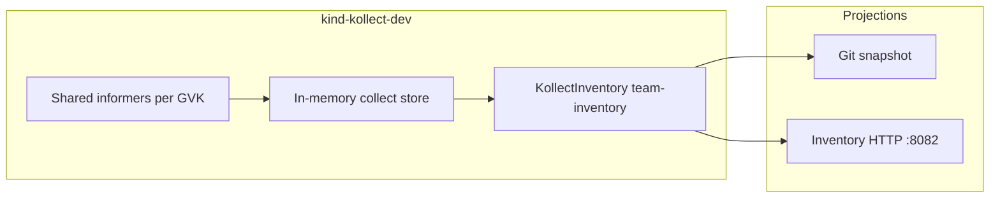
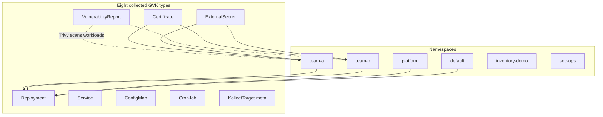

# Kollect wide-scope demo — sales pitch on kind

**Kollect** turns selected, live cluster state into a **durable, queryable, diffable inventory**.
This demo is the showcase walkthrough: a motivational story from problem → answer → live cluster →
measurable outcomes, exporting to
[github.com/konih/kollect-inventory-demo](https://github.com/konih/kollect-inventory-demo).

> Run from the repo root. Cluster name **`kollect-dev`** (`kind-kollect-dev` context) matches
> `task kind-dev-up` / `task kind-dev-down`.

---

## The story

### 1. The problem

Platform and security teams juggle **fleet topology**, **CVE posture**, **TLS expiry**, and
**secret sync state** — but stakeholders cannot live-list the apiserver forever. Dashboards break
when RBAC, scale, or apiserver availability gets in the way.

### 2. The Kollect answer

**Select** resources by GVK → **extract** attributes (CEL / JSONPath) → **aggregate** across Targets →
**debounce** → **export** to pluggable sinks. Inventory is **configuration, not code** — owned per
team in Kubernetes.



### 3. Live walkthrough

One guided script provisions everything:

```sh
export GITHUB_TOKEN="$(gh auth token)"   # repo scope — never commit
bash hack/demo/kind-wide-scope/demo.sh
```

With churn in the background (12-minute scripted mutations → Git diffs):

```sh
bash hack/demo/kind-wide-scope/demo.sh --churn
```

Non-interactive (CI / automation):

```sh
DEMO_AUTO_YES=1 bash hack/demo/kind-wide-scope/demo.sh
```

The driver uses **[Charm Gum](https://github.com/charmbracelet/gum)** for bubble-style guided
shell UX (auto-installed via `go install` when missing).

#### What happens step-by-step

| Step | Script / manifest | What you see |
| --- | --- | --- |
| 1 | [`demo.sh`](demo.sh) + `KOLLECT_DEV_MINIMAL=1 task kind-dev-up` | kind cluster + Kollect operator |
| 2 | [`install-platform.sh`](install-platform.sh) | Trivy Operator, cert-manager, external-secrets |
| 3 | [`base/kollect/secret.example.yaml`](base/kollect/secret.example.yaml) pattern | `git-push-credentials` from `GITHUB_TOKEN` |
| 4 | [`kustomization.yaml`](kustomization.yaml) | Scope → Profiles → Targets → Sink → Inventory → fleet |
| 5 | [`churn.sh`](churn.sh) (optional) | Adds/updates/deletes rows; Git commits every ~15s |
| 6 | [`logs.sh`](logs.sh) | Collection + export log followers |

#### Demo topology



### 4. Outcomes

- **Git history** — `chore(inventory): export default/team-inventory` commits with JSON diffs
- **Security inventory** — Trivy `VulnerabilityReport` rows with CVE counts per workload image
- **TLS inventory** — cert-manager `Certificate` expiry and issuer attributes
- **Secrets posture** — `ExternalSecret` sync status without exporting secret bytes
- **Fleet churn** — scale, image bumps, label patches, deletes visible in export diffs

---

## Use cases woven in

### Headline: Trivy CVE reports

Trivy Operator scans demo workloads (`traefik/whoami`, `redis`, `prometheus`, …) and creates
`aquasecurity.github.io/v1alpha1` **VulnerabilityReport** CRs. Kollect collects them via Target
[`fleet-*` / `trivy-vulnerability-reports`](base/kollect/targets.yaml) and Profile
[`trivy-vulnerability-summary`](base/kollect/profiles.yaml).

!!! tip "Security team workflow"
    Export CVE summaries to Git for audit diffs, or point the same Profile at Postgres for SQL
    dashboards — no bespoke Trivy exporter code.

### cert-manager certificates

Self-signed [`ClusterIssuer`](base/platform/issuers.yaml) plus
[`Certificate`](base/platform/crs/certificates.yaml) CRs in `team-a` / `team-b`. Target
[`fleet-certificates`](base/kollect/targets.yaml) rolls up `notAfter`, issuer, and readiness.

### external-secrets sync state

[`ExternalSecret`](base/platform/crs/external-secrets.yaml) CRs (fake + kubernetes providers) show
how Kollect inventories **platform CRDs** generically — same Profile/Target model as Deployments.

---

## Prerequisites

| Item | Notes |
| --- | --- |
| Tools | `kind`, `kubectl`, `helm`, `kustomize`, `task`, `docker`, `gh`, `go` (for Gum fallback) |
| Cluster | `kollect-dev` — created by demo if absent |
| Token | `GITHUB_TOKEN` with `repo` scope for Git push |
| Gum | Optional pre-install: `go install github.com/charmbracelet/gum@latest` |

!!! warning "Writable /tmp on manager pod"
    Git export clones into `/tmp`. The Helm chart mounts `emptyDir` at `/tmp` — use
    `charts/kollect/ci/dev-values.yaml` via `task kind-dev-up`.

---

## Kustomize layout

```
hack/demo/kind-wide-scope/
├── kustomization.yaml          # kubectl apply -k entry
├── demo.sh                     # Guided driver (preferred)
├── bootstrap.sh                # Alias → demo.sh
├── install-platform.sh         # Helm: Trivy, cert-manager, external-secrets
├── churn.sh / logs.sh
├── lib/ui.sh                   # Charm Gum helpers
├── base/
│   ├── namespaces.yaml
│   ├── kollect/                # Kollect CRs
│   ├── workloads/              # Core fleet (no nginx)
│   └── platform/
│       ├── issuers.yaml        # cert-manager ClusterIssuer
│       └── crs/                # Certificate + ExternalSecret CRs
└── samples/                    # Annotated CR walkthrough
```

Validate locally:

```sh
kustomize build hack/demo/kind-wide-scope/ >/dev/null
```

---

## Annotated samples

Step-by-step Kollect CRs with inline comments:
[`hack/demo/kind-wide-scope/samples/`](samples/).

Equivalent to `config/samples/` style but tuned for this demo narrative.

---

## Verify export

### In-cluster HTTP

```sh
kubectl port-forward -n kollect-system svc/kollect-controller-manager 8082:8082 &
curl -sf http://127.0.0.1:8082/inventory | jq '{itemCount, sample: .items[0]}'
kubectl get kollectinventory team-inventory -n default -o yaml | grep -A20 'status:'
```

### Upstream CR row counts

```sh
kubectl get vulnerabilityreports -A
kubectl get certificates -A -l app.kubernetes.io/part-of=demo-fleet
kubectl get externalsecrets -A -l kollect.dev/inventory=enabled
```

### Demo repo commits

```sh
export GIT_EXPORT_TEST_REPO=https://github.com/konih/kollect-inventory-demo.git
bash hack/e2e/git-export-assert.sh
```

```sh
gh api repos/konih/kollect-inventory-demo/commits --jq '.[0:5][] | {sha: .sha[0:7], message: .commit.message}'
```

---

## Churn choreography

[`churn.sh`](churn.sh) — ~12 minutes, one mutation every ~2 minutes:

| Time | Action | Inventory delta |
| --- | --- | --- |
| T+1m | Scale `api-gateway` 2→3 | `replicas` change |
| T+3m | `frontend` image `whoami:v1.10.2` → `v1.11.0` | `image` change + new Trivy report |
| T+5m | Label patch `backend` | `labels` map change |
| T+7m | `feature-flags` data patch | `keyCount` / `dataKeys` change |
| T+9m | Delete `catalog-sync` | Row removed |
| T+11m | Create `billing-api` | New row |
| T+13m | Suspend `weekly-report` CronJob | `suspend: true` |
| T+15m | Delete/recreate `storefront-demo` Service | `clusterIP` refresh |

---

## Troubleshooting

| Symptom | Likely cause | Fix |
| --- | --- | --- |
| `mkdir /tmp/kollect-git-export-*: read-only file system` | Missing `/tmp` emptyDir | Reinstall via `task kind-dev-up`; check chart deployment volumeMount |
| `ConnectionVerified=False` | Missing `git-push-credentials` | Recreate secret from `GITHUB_TOKEN`; see [`secret.example.yaml`](base/kollect/secret.example.yaml) |
| No Git commits | Egress/DNS to `github.com` | Curl pod from `kollect-system` |
| `itemCount` stuck low | Targets not matching | `kubectl get ktgt -n default`; check labels / `includedNamespaces` |
| No VulnerabilityReports | Trivy Operator not ready | `kubectl get pods -n trivy-system`; wait for scans (~2–5 min) |
| Certificate / ExternalSecret apply errors | Platform operators skipped | Run `bash hack/demo/kind-wide-scope/install-platform.sh` |
| Scope denied | GVK outside `demo-wide-scope` | `kubectl describe kollectscope demo-wide-scope -n default` |

---

## Manual equivalent

```sh
KOLLECT_DEV_MINIMAL=1 task kind-dev-up
kubectl config use-context kind-kollect-dev
bash hack/demo/kind-wide-scope/install-platform.sh
# secret from GITHUB_TOKEN …
kubectl apply -k hack/demo/kind-wide-scope/
bash hack/demo/kind-wide-scope/churn.sh   # optional
```

---

## See also

- [Kind local lab](../../docs/examples/kind-local-lab.md) — operator install
- [Git inventory demo](../../docs/examples/kollect-inventory-demo.md) — minimal single-GVK path
- [Trivy target example](../../docs/examples/kollecttarget_trivy-high.yaml) — `resourceRules` filtering
- [Deployment inventory](../../docs/examples/deployment-inventory.md) — Profile → Target deep dive
