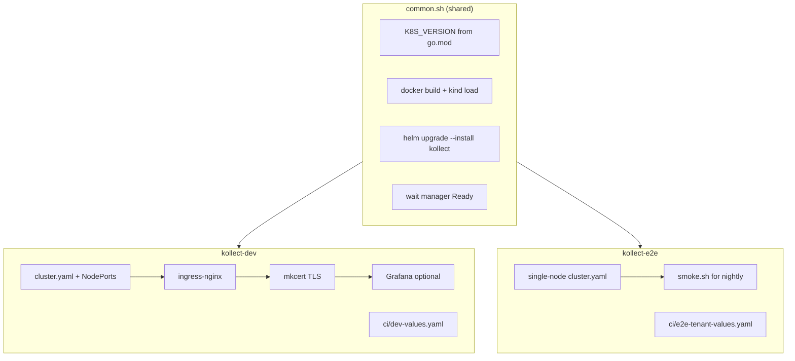

# Local kind clusters

Two lean [kind](https://kind.sigs.k8s.io/) profiles share install logic via
[`common.sh`](common.sh) (Kubernetes version pin, image build/load, Helm install, manager Ready
wait). Dev adds optional addons; e2e stays minimal for CI speed.



## Cluster comparison

| | **kollect-dev** | **kollect-e2e** |
| --- | --- | --- |
| **Purpose** | Daily local development | CI / nightly smoke |
| **Nodes** | 1 control-plane (ingress NodePorts 30080/30443) | 1 control-plane only |
| **Addons** | ingress-nginx, mkcert TLS, Grafana; optional Prometheus | None |
| **Helm values** | `charts/kollect/ci/dev-values.yaml` | `charts/kollect/ci/e2e-tenant-values.yaml` |
| **Skip addons** | `KOLLECT_DEV_MINIMAL=1 task kind-dev-up` | — |
| **Task targets** | `kind-dev-up`, `kind-dev-down`, `kind-dev-load`, `kind-dev-status` | `kind-e2e-up`, `kind-e2e-down` |

Both clusters pin the node image to the Kubernetes minor version derived from `go.mod`
(`k8s.io/api` → `kindest/node:v1.x.x`), keeping local dev, envtest, and CI aligned.

Install waits are configurable via `KIND_CLUSTER_WAIT`, `KOLLECT_HELM_TIMEOUT`, and
`KOLLECT_MANAGER_WAIT` (default **300s** each in `common.sh`). Post-install smoke scripts use
`WAIT_TIMEOUT` (default **180s**). Cert-manager Certificate collection runs in `smoke.sh` **after**
Helm install — it does not block operator startup (`webhooks.enabled: false` in e2e values).

## Quick start

```sh
# Dev (full addons)
task kind-dev-up

# Dev (operator only — faster on laptops)
KOLLECT_DEV_MINIMAL=1 task kind-dev-up

# Rebuild image after code changes
task kind-dev-load

# Status
task kind-dev-status

# Teardown
task kind-dev-down
```

E2E profile (matches nightly workflow):

```sh
task kind-e2e-up
bash hack/kind/e2e/smoke.sh   # post-install checks (lean samples/ + cert-manager Certificate CRD smoke)
task kind-e2e-down

# Or one-shot via Task (setup + smoke + teardown):
task test:e2e
```

## Running the assertions on a non-Kind cluster (LAB-DEKIND)

Creating a cluster and asserting against one are separate steps. `common.sh` resolves the
substrate of the **current** kube context through the lab allowlist
([`hack/lab/substrates.conf`](../lab/substrates.conf)) and refuses anything unlisted, so an
install can never land on an ambient production context. Substrate also decides image
delivery: Kind builds and side-loads, everything else **must** use a pinned registry
reference (`KOLLECT_IMAGE=ghcr.io/platformrelay/kollect:v<semver>`) because there is no
`kind load` equivalent — a local-only or `:latest`/`:dev` tag is rejected before install.

The webhook scenario (`hack/e2e/webhook-smoke.sh`) can assert against an existing cluster
without creating anything, using server-side dry runs only:

```sh
KOLLECT_E2E_EXISTING_CLUSTER=1 KOLLECT_RELEASE=kollect-op1 KOLLECT_NAMESPACE=kollect-op1 \
  task lab:webhook-smoke
```

CI is unaffected: with no extra environment set, the Kind path behaves exactly as before.

`kollect_e2e_select_context` in `common.sh` is the seam: it switches to `kind-<cluster>` by
default and, in existing-cluster mode, validates the current context against the allowlist
instead. Other scenario scripts can adopt it one line at a time.

### Still Kind-only (deliberate)

| Assumption | Where | Why it was left |
| --- | --- | --- |
| Switches to the `kind-kollect-e2e` context, then creates/deletes CRs, namespaces and sinks | `hack/kind/e2e/smoke.sh`, `bootstrap-samples.sh`, `pipeline-cli-smoke.sh`, `hack/e2e/{cert-manager,tenant-mode,multitenant,finalizer-cleanup-assert,git-export-assert}.sh` | These are *mutating* scenarios. Read-only server dry runs cannot express them, so pointing them at a lab cluster that is holding evidence is unsafe by construction. They can adopt `kollect_e2e_select_context` when a disposable lab cluster exists. |
| Single-node `cluster.yaml`, `kindest/node` version resolution, dev NodePorts 30080/30443 | `hack/kind/e2e/cluster.yaml`, `hack/kind/dev/`, `common.sh` | Only used while *creating* a kind cluster; unreachable on an existing-cluster run. |
| cert-manager `Certificate` gate for the webhook serving cert | `hack/e2e/webhook-smoke.sh` | Fixed for existing clusters — the wait is skipped when cert-manager does not manage the release's cert, and the webhook itself is asserted instead. |
| `kind load docker-image` | `common.sh` | Fixed — substrate decides delivery; non-Kind requires a pinned registry reference. |

No storage-class, hostPath or LoadBalancer assumptions exist in the e2e path (the e2e chart
values request none), so nothing there blocks a bare-metal lab.

## Prerequisites (dev)

| Tool | Required for |
| --- | --- |
| Docker (or nerdctl/podman) | kind |
| [kind](https://kind.sigs.k8s.io/) v0.32+ | both profiles |
| [helm](https://helm.sh/) | both profiles |
| [mkcert](https://github.com/FiloSottile/mkcert) | dev TLS only (skipped gracefully if missing) |

Generated mkcert material lives under `hack/kind/dev/certs/` (git-ignored).

Optional: `KOLLECT_DEV_PROMETHEUS=1` installs a single-replica Prometheus in `monitoring`.

## Layout

```
hack/kind/
├── common.sh           # shared version, cluster, helm, image helpers
├── README.md
├── dev/
│   ├── cluster.yaml    # ingress NodePort mappings
│   ├── setup.sh        # cluster + operator + addons
│   ├── teardown.sh
│   └── status.sh
└── e2e/
    ├── cluster.yaml    # minimal single node
    ├── setup.sh        # cluster + operator only
    ├── smoke.sh        # nightly post-install smoke
    └── teardown.sh

E2e smoke applies lean samples from `config/samples/` plus `config/samples/e2e/` (inventory with
`snapshotSinkRefs`, minimal `KollectSnapshotSink`) — no Postgres/Kafka sink probes.
```
